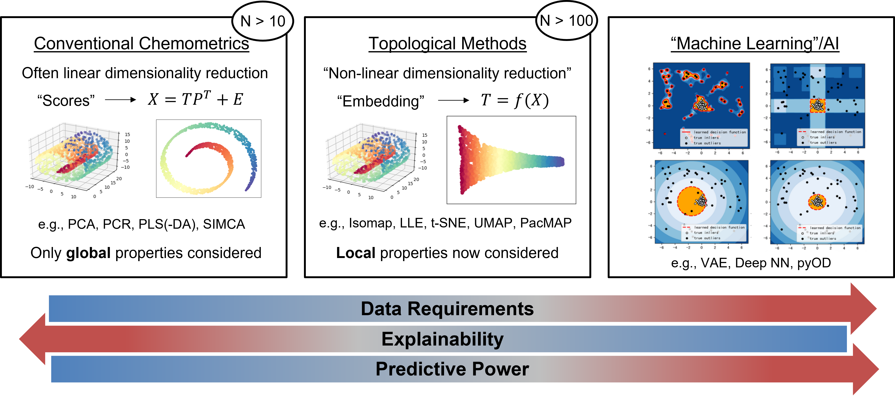

.. PyChemAuth documentation master file, created by
   sphinx-quickstart on Tue Aug 22 21:08:52 2023.
   You can adapt this file completely to your liking, but it should at least
   contain the root `toctree` directive.

=======================================
Python-based Chemometric Authentication
=======================================
.. image:: https://img.shields.io/badge/pre--commit-enabled-brightgreen?logo=pre-commit&logoColor=white
   :target: https://github.com/pre-commit/pre-commit
.. image:: https://img.shields.io/badge/code%20style-black-000000.svg
   :target: https://github.com/psf/black
.. image:: https://img.shields.io/badge/%20imports-isort-%231674b1?style=flat&labelColor=ef8336
   :target: https://pycqa.github.io/isort/
.. image:: https://github.com/mahynski/pychemauth/actions/workflows/python-app.yml/badge.svg?branch=main
   :target: https://github.com/mahynski/pychemauth/actions
.. image:: https://zenodo.org/badge/331207062.svg
   :target: https://zenodo.org/badge/latestdoi/331207062

This is a toolkit to perform chemometric analysis, though it is primarily focused on authentication.  These methods are designed to follow `scikit-learn's estimator API <https://scikit-learn.org/stable/developers/develop.html>`_ so that they can be deployed in pipelines used with GridSearchCV, etc. and are compatible with workflows involving other modern machine learning (ML) tools.  `Wikipedia <https://en.wikipedia.org/wiki/Chemometrics>`_ defines chemometrics as "the science of extracting information from chemical systems by data-driven means." Unlike other areas of science, technology and engineering, many chemical systems remain difficult to collect measurements on making data more scarce than in other arenas.  As a result, conventional statistical methods remain the predominant tool with which chemometric analysis is performed.  As instruments improve, databases are developed, and advanced algorithms become less data-intensive it is clear that modern machine learning and artificial intelligence (AI) methods will be brought to bear on these problems.  A consistent API enables many different models to be easily deployed and compared.

Authentication is typically a `one-class classification (OCC) <https://en.wikipedia.org/wiki/One-class_classification>`_, or class modeling, approach designed to detect anomalies. This contrasts with conventional multi-class classification (discriminative) models which involve supervised learning of multiple classes to distinguish between them; the primary weakness of such a model is that it cannot predict if a new sample belongs to **none** of the classes trained on. Within the context of anomaly detection, `scikit-learn <https://scikit-learn.org/stable/modules/outlier_detection.html>`_ differentiates between outlier detection and novelty detection.  In outlier detection, the training data is considered polluted and certain samples need to be detected and removed, whereas novelty detection methods assume the training data is "clean" and anomalies need to be detected during the testing phase of new samples only.  Both are important in the context of authentication models; here is a nice repository for more `anomaly detection resources <https://github.com/yzhao062/anomaly-detection-resources>`_.

Out-of-distribution (OOD) detection is a more general term which encompasses these and other tasks, such as open-set recognition.  A taxonomy describing how these tasks are interrelated can be found `here <https://arxiv.org/abs/2110.11334>`_ and further reading `here <https://arxiv.org/abs/2110.14051>`_. Detecting distribution shifts in the data at test-time is critical to building safe, reliable models deployed in real (open) world settings.

License Information
###################
* See LICENSE for more information.
* Any mention of commercial products is for information only; it does not imply recommendation or endorsement by `NIST <https://www.nist.gov/>`_.

Core Capabilities
#################

Exploratory Data Analysis
*************************
You should always perform `exploratory data analysis <https://www.itl.nist.gov/div898/handbook/eda/section1/eda11.htm>`_ to understand your data.  For example, understanding missing values, NaN, inf and basic `descriptive statistics <https://pandas.pydata.org/docs/reference/api/pandas.DataFrame.describe.html>`_.  While python libraries like `Pandas <https://pandas.pydata.org/>`_ and `DTale <https://github.com/man-group/dtale>`_ are excellent pre-existing tools, the :py:mod:`eda` package herein contains additional methods.

Preprocessors
*************
`scikit-learn <https://scikit-learn.org>`_ provides a number of other simple `preprocessing <https://scikit-learn.org/stable/modules/preprocessing.html>`_ and normalization steps, including data standardization and imputation approaches.  PyChemAuth extends these to include:

Imputing Missing Data
=====================
* `Expectation Maximization with Iterative PCA (missing X values) <https://www.sciencedirect.com/science/article/pii/S0169743901001319?casa_token=PJMbl_1gHmoAAAAA:0Q4M969UyZ-MYQY44S0dFMtH77aX-AOxcCRSFBaDHuvsd2UnulLO3cUxh5GlHXnyJBzSp3oneO00>`_
* `Expectation Maximization with Iterative PLS (missing X values) <https://www.sciencedirect.com/science/article/pii/S0169743901001319?casa_token=PJMbl_1gHmoAAAAA:0Q4M969UyZ-MYQY44S0dFMtH77aX-AOxcCRSFBaDHuvsd2UnulLO3cUxh5GlHXnyJBzSp3oneO0>`_
* Limit of Detection (randomly below LOD)

Scaling
=======
* Corrected Scaling (akin to scikit-learn's `StandardScaler <https://scikit-learn.org/stable/modules/generated/sklearn.preprocessing.StandardScaler.html>`_ but uses `unbiased/corrected standard deviation <https://en.wikipedia.org/wiki/Standard_deviation#Corrected_sample_standard_deviation>`_ instead)
* Pareto Scaling (divides by square root of standard deviation)
* Robust Scaling (divides by IQR instead of standard deviation)

Filtering
=========
* `Savitzky-Golay <https://en.wikipedia.org/wiki/Savitzky%E2%80%93Golay_filter>`_
* Standard and Robust Normal Variates, `SNV, RNV <https://www.sciencedirect.com/topics/mathematics/standard-normal-variate>`_
* Multiplicative Scatter Correction, `MSC <https://guifh.github.io/RNIR/MSC.html>`_

Generating Synthetic Data
=========================
* `Resampling <https://scikit-learn.org/stable/modules/generated/sklearn.utils.resample.html#sklearn.utils.resample>`_ can be used to balance classes during training, or to supplement measurements that are very hard to make.  New, synthetic data can also be generated by various means; `imblearn <https://imbalanced-learn.org/stable/>`_ pipelines are designed to work with various up/down sampling routines and can be used as drop-in replacements for standard scikit-learn pipelines.
* See `Imbalanced Learning <https://imbalanced-learn.org/stable/index.html>`_ for methods like SMOTE, ADASYN, etc.

Feature Selection
=================
`Feature extraction <https://scikit-learn.org/stable/modules/feature_extraction.html>`_, such as PCA, involves manipulating inputs to produce new "dimensions" or composite features, such as the first principal component. `Feature selection <https://scikit-learn.org/stable/modules/feature_selection.html>`_ simply involves selecting a subset of known features (such as columns) to use.  scikit-learn has many `built-in examples <https://scikit-learn.org/stable/modules/classes.html#module-sklearn.feature_selection>`_ that you can use.  Additional tools such as `BorutaSHAP <https://github.com/Ekeany/Boruta-Shap>`_ and some based on the `Jensen-Shannon Divergence <https://en.wikipedia.org/wiki/Jensen%E2%80%93Shannon_divergence>`_ are also implemented here.

Conventional Chemometrics (Small data limit)
############################################

`Conventional chemometric authentication methods <https://www.sciencedirect.com/science/article/pii/S0003267017306050?casa_token=7wJt53xzxFgAAAAA:LSvTEjSKSTXsoFfH71ccxnP5eOj9OX3VxnPhA1t02FYYfsKosJQjq3s-rgKJUX0VNu7sFrrYvbA>`_ generally fall under the umbrella of multivariate regression or classification tasks.  For example, the model proposed when performing multilinear regression is :math:`\vec{y} = \mathbf{M} \mathbf{X} + \vec{b}`, where the matrix :math:`\mathbf{M}` must be solved for. (Un)supervised classification is commonly performed via `projection methods <https://www.sciencedirect.com/science/article/pii/S0169743902001077?casa_token=Drui6g1wMgQAAAAA:qG1E9HHTSWrM1UhkWnLWw2iBxFAOa0Qsi9LblalX4PvfLCHNay0m-besnzOyZwXtBfI4LLGp7wQ>`_, which compress the data into a lower dimensional space. A common choice of data models is: :math:`\mathbf{X} = \mathbf{T} \mathbf{P^T} + \mathbf{E}`, where the scores matrix, :math:`\mathbf{T}`, represents the projection of the :math:`\mathbf{X}` matrix into a (typically lower dimensional) score space. The :math:`\mathbf{P}` matrix, called the `loadings matrix <http://www.statistics4u.com/fundstat_eng/cc_pca_loadscore.html>`_, is computed in different ways.  For example, PCA (unsupervised) uses the leading eigenvectors of the covariance matrix of :math:`\mathbf{X}`, whereas `PLS <https://scikit-learn.org/stable/modules/cross_decomposition.html#cross-decomposition>`_ uses a different (supervised, cross-) decomposition which is a function of both :math:`\mathbf{X}` and :math:`\vec{y}`. :math:`\mathbf{E}` is the error resulting from this model.

OCC methods require careful preparation of the training set to remove outliers so that "masking" effects do not affect your final model. Manual data inspection is typically required. Thus, conventional authentication methods can be considered `novelty detection <https://scikit-learn.org/stable/modules/outlier_detection.html>`_ methods (no outliers in training), but many have built in capabilities to interatively "clean" the training set if outliers are assumed to be present initially. See `"Detection of Outliers in Projection-Based Modeling" by Rodionova and Pomerantsev <https://pubs.acs.org/doi/abs/10.1021/acs.analchem.9b04611>`_ for an example of outlier detection and removal in projection-based modeling.

Classifiers
***********
* PCA (for data inspection)
* PLS-DA (soft and hard variants) - `discriminant analysis is not the same as OCC for authentication <https://analyticalsciencejournals.onlinelibrary.wiley.com/doi/abs/10.1002/cem.3030>`_.
* SIMCA
* DD-SIMCA

Regressors
**********
* PCR
* PLS

Some Further Reading
********************
* `Morais, C. LM, et al. "Tutorial: multivariate classification for vibrational spectroscopy in biological samples." Nature Protocols 15.7 (2020): 2143-2162. <https://www.nature.com/articles/s41596-020-0322-8>`_
* `Rodionova, O. Y., and A. L. Pomerantsev. "Chemometric tools for food fraud detection: The role of target class in non-targeted analysis." Food chemistry 317 (2020): 126448. <https://www.sciencedirect.com/science/article/pii/S0308814620303101?casa_token=leLkME6puuUAAAAA:zVpftqGoeRPOrPQe3kC8lXb0SVD92sOJKvSD9hdcSyICKTACm77-GvTtrLmq4PMxBR_pF2oVxIw>`_
* `Pomerantsev, A. L., and O. Y. Rodionova. "Multiclass partial least squares discriminant analysis: Taking the right way—A critical tutorial." Journal of Chemometrics 32.8 (2018): e3030. <https://analyticalsciencejournals.onlinelibrary.wiley.com/doi/abs/10.1002/cem.3030>`_
* `Oliveri, P. "Class-modelling in food analytical chemistry: development, sampling, optimisation and validation issues–a tutorial." Analytica chimica acta 982 (2017): 9-19. <https://www.sciencedirect.com/science/article/pii/S0003267017306050?casa_token=oVsuIrrNPVwAAAAA:MEUtEmvrdm9s2He633MDjYEL9HhZ8rDewN3zCPWfVW8XkIfaS388sp1xkONVsWN6RcBR0EGdi6Y>`_
* `Rodionova, O. Y., A. V. Titova, and A. L. Pomerantsev. "Discriminant analysis is an inappropriate method of authentication." TrAC Trends in Analytical Chemistry 78 (2016): 17-22. <https://www.sciencedirect.com/science/article/pii/S0165993615302193?casa_token=LhD_JTNn8PwAAAAA:9AsgZk7HsxoB8BDI88jZtNb8rbe48CiGT_lqtl8_RkF4EYABv3oltVi4N5YXe-CqRzvz3J_14bc>`_
* `Marini, F. "Classification methods in chemometrics." Current Analytical Chemistry 6.1 (2010): 72-79. <https://www.researchgate.net/profile/Federico-Marini-2/publication/232696878_Classification_methods_in_chemometrics/links/53fda10c0cf2364ccc08e208/Classification-methods-in-chemometrics.pdf>`_
* `Forina, M., et al. "Class-modeling techniques, classic and new, for old and new problems." Chemometrics and Intelligent Laboratory Systems 93.2 (2008): 132-148. <https://www.sciencedirect.com/science/article/pii/S0169743908000920?casa_token=teZELafmfmMAAAAA:evqDipEdosbDp2d6dmSXl4_eRbafJtY-KkzQgpjZhVc-VooGnXRvqAla91RBmJBriFhM7d5j7BQ>`_

Topological Methods (Intermediate data limit)
#############################################

   "Manifold Learning can be thought of as an attempt to generalize linear frameworks like PCA to be sensitive to non-linear structure in data. Though supervised variants exist, the typical manifold learning problem is unsupervised: it learns the high-dimensional structure of the data from the data itself, without the use of predetermined classifications." - scikit-learn `documentation <https://scikit-learn.org/stable/modules/manifold.html>`_

* `Kernel PCA <https://scikit-learn.org/stable/modules/generated/sklearn.decomposition.KernelPCA.html?highlight=kernel%20pca#sklearn.decomposition.KernelPCA>`_
* `Isomap <https://scikit-learn.org/stable/modules/generated/sklearn.manifold.Isomap.html#sklearn.manifold.Isomap>`_
* `Locally Linear Embedding <https://scikit-learn.org/stable/modules/generated/sklearn.manifold.LocallyLinearEmbedding.html#sklearn.manifold.LocallyLinearEmbedding>`_
* `Kohonen Self-Organizing Maps (SOM) <https://pypi.org/project/sklearn-som/>`_
* `UMAP <https://umap-learn.readthedocs.io/en/latest/>`_

These approaches may be considered intermediate between conventional chemometric methods and modern AI/ML algorithms.  These are generally `non-linear dimensionality reduction <https://en.wikipedia.org/wiki/Nonlinear_dimensionality_reduction>`_ methods that try to preserve properties, like the topology, of the original data; once projected into a lower dimensional space (embedding), statistical models can be constructed, for example, by drawing an ellipse around the points belonging to a known class. Conventional chemometric authentication methods operate in a similar fashion but with a simpler dimensionality reduction step. Although `many methods <https://scikit-learn.org/stable/modules/outlier_detection.html>`_ can be used to detect anomalies in this embedding (score space), we favor the `elliptic envelope <https://scikit-learn.org/stable/modules/generated/sklearn.covariance.EllipticEnvelope.html#sklearn.covariance.EllipticEnvelope>`_ here for its simplicity and statistical interpretability. Only members of one known class are purposefully trained on (at a time).
* :py:class:`EllipticManifold` - a combined manifold learning/dimensionality reduction step followed by the determination of an elliptical boundary to detect outliers.

Machine Learning (Large data limit)
###################################

In ML/AI, the problem of detecting novelties (a previously unknown class) when only a finite subset of known classes are available for training is known as `open set recognition <https://www.wjscheirer.com/projects/openset-recognition/>`_.  Here are some references for further reading:

* `Yang, J., Zhou K., Li Y., and Z. Liu. "Generalized out-of-distribution detection: A survey," (2022): arXiv:2110.11334 <https://arxiv.org/abs/2110.11334>`_
* `Salehi, M., Mirzaei, H., Hendrycks, D., Li, Y., Rohban, M. H., and M. Sabokrou. "A unified survey on anomaly, novelty, open-set, and out-of-distribution detection: Solutions and future challenges," (2021): arXiv:2110.14051 <https://arxiv.org/abs/2110.14051>`_
* A curated `GitHub repo <https://github.com/iCGY96/awesome_OpenSetRecognition_list>`_ list of papers and resources.
* `Perera, P., P. Oza, and V. M. Patel. "One-class classification: A survey," (2021): arXiv:2101.03064 <https://arxiv.org/abs/2101.03064>`_
* `Geng, C., S.-J. Huang, and S. Chen. "Recent Advances in Open Set Recognition: A Survey." (2018): arXiv:1811.08581v4 <https://arxiv.org/pdf/1811.08581.pdf>`_
* `Vaze, S., H. Han, A. Vedaldi, and A. Zisserman. "Open-Set Recognition: a Good Closed-Set Classifier is All You Need?" (2021): arXiv:2110.06207v2 <https://arxiv.org/pdf/2110.06207.pdf>`_
* `Dietterich, T., and A. Guyer. "The familiarity hypothesis: Explaining the behavior of deep open set methods." Pattern Recognition 132 (2022): 108931 <https://www.sciencedirect.com/science/article/pii/S0031320322004125>`_

These routines offer the most flexible approaches and include alternative boundary construction methods besides ellipses.  Detecting "new or unusual" objects with AI/ML is often formulated as an outlier detection problem.  This is a fairly mature field when it comes to feature-vector data for conventional ML/statistical algorithms, but deep learning approaches currently struggle to outperform their other ML counterparts (see the `"Familiarity Hypothesis" <https://www.sciencedirect.com/science/article/pii/S0031320322004125>`_ by Dietterich and Guyer).
* Outlier detection with `PyOD <https://pyod.readthedocs.io/en/latest/>`_ - This encompasses many different approaches including isolation forests and autoencoders.
* Semi-supervised `Positive-Unlabeled (PU) learning <https://pulearn.github.io/pulearn/>`_

Explanations and Interpretations
################################

:py:mod:`pychemauth.analysis.inspect` provides a number of tools and wrappers for model inspection methods.  For example:

* :py:func:`Partial dependence plots` illustrate the dependence of the response variable, :math:`\vec{y}`, and each of its features (columns in :math:`\mathbf{X}`) by averaging over the values of the rest of the features.  See `scikit-learn's discussion <https://scikit-learn.org/stable/modules/partial_dependence.html>`_ for more information.
* :py:func:`Permutation feature importance` is an inspection method that describes the importance of a feature based on how much more poorly a fitted model performs when it is shuffled.  This is model agnostic, but can be strongly influenced by strongly correlated features. See `scikit-learn's discussion <https://scikit-learn.org/stable/modules/permutation_importance.html#permutation-feature-importance>`_ for more information.

While examination of loadings, for example, is one way to understand commonly employed chemometric tools, more complex models require more complex tools to inspect these "black boxes".

* `SHAP <https://shap.readthedocs.io/en/latest/>`_ - "(SHapley Additive exPlanations) is a game theoretic approach to explain the output of any machine learning model. It connects optimal credit allocation with local explanations using the classic Shapley values from game theory and their related extensions."  Its model-agnostic nature means that this can be employed to explain any model or pipeline.
* `LIME <https://github.com/marcotcr/lime>`_ - Local Interpretable Model-agnostic Explanations constructs a simpler, more interpretable model around a point in question to help understand why a prediction about this point has been made.

"Interpretable AI" refers to models which are inherently a "glassbox" and their inner-workings are transparent.  This is `not the same as "explained black boxes" (XAI) <https://projecteuclid.org/journals/statistics-surveys/volume-16/issue-none/Interpretable-machine-learning-Fundamental-principles-and-10-grand-challenges/10.1214/21-SS133.full>`_ which are inscrutable, by definition, but methods like SHAP can be used to help the user develop a sense of (dis)trust about the model and potentially debug it.  Explainable boosting machines (EBM) are a discriminative method, but can be helpful to compare and contrast with explained black boxes or authentication models. EBMs are slow to train so they are best for small-medium data applications, which many chemometric applications fall under.

* An `EBM <https://interpret.ml/docs/ebm.html>`_ from `interpretML <https://interpret.ml>`_ is a "tree-based, cyclic gradient boosting Generalized Additive Model with automatic interaction detection. EBMs are often as accurate as state-of-the-art blackbox models while remaining completely interpretable."
* `pyGAM <https://pygam.readthedocs.io/en/latest/index.html>`_ does not follow scikit-learn's API but are very useful glassbox models to consider.

"Probabilities" that ML routines produce are usually not guaranteed to be "meaningful."  Elliptic boundaries and other conventional techniques often invoke assumptions about the normality of the data, for example, that allow meaningful interpretation of distances and probabilities that these methods yield.  For example, if you have a set of points for which the probability of class membership is 80%, you would expect 80% of those points to belong to the class and to be incorrect about 20% of them.  However, ML routines often produce  "probabilities" which are nothing more than numerical values whose maximum determines the assigned classes; the exact value of that probability does not need to be meaningful for these routines to produce (accurate) predictions of class membership. This can be addressed with `probability calibration <https://scikit-learn.org/stable/modules/calibration.html#calibration>`_.  The basic solution is to add another function that translates the output of an ML model into something more meaningful.  See `here <https://scikit-learn.org/stable/modules/calibration.html#calibration>`_ for more detailed examples and discussion.  Calibration may be particular useful before trying to apply explanation tools or interpret the results of a model.

Diagnostics
###########

:py:mod:`pychemauth.analysis.inspect` also provides a number of tools to understand model performance.  For example:

* `Learning curves <https://scikit-learn.org/stable/modules/learning_curve.html#learning-curve>`_ can be used to tell if your model will benefit from more data, or if you need a more powerful model to achieve better performance.
* `Confusion matrices` help identify which classes a model tends to confuse and which it can easily distinguish between.

.. toctree::
   :maxdepth: 3
   :caption: Contents:

   quickstart 
   citation
   contributing
   modules

.. toctree::
   :includehidden:
   :caption: Tutorial

   toy_examples
..   real_world

..
   .. toctree::
      :includehidden:
      :caption: Learn

      eda
      cross_validation
      statistial_methods
      machine_learning
      deep_learning

Indices and tables
==================

* :ref:`genindex`
* :ref:`modindex`
* :ref:`search`
